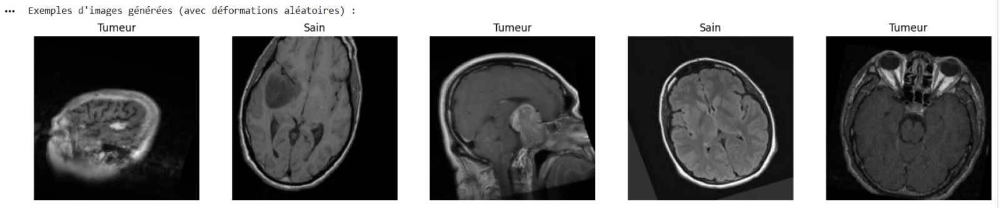
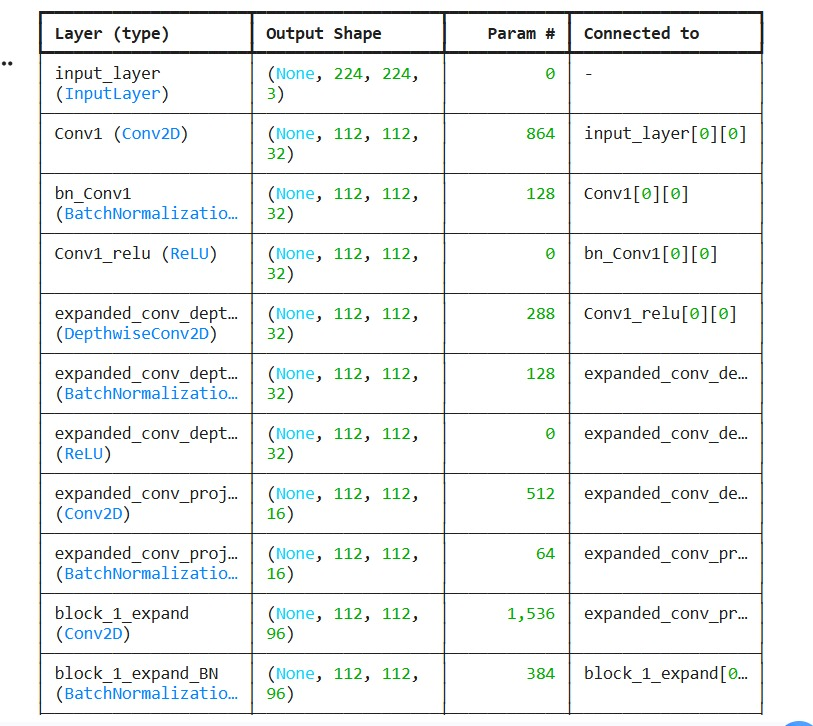
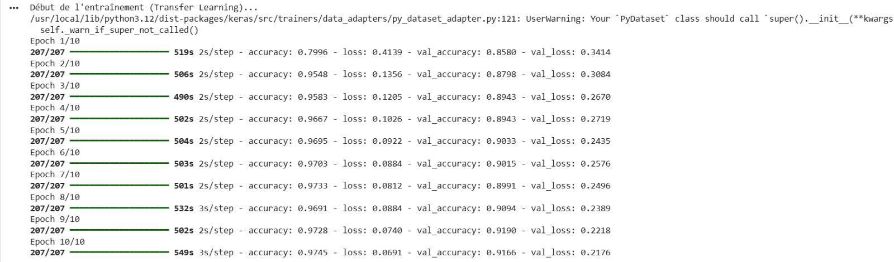
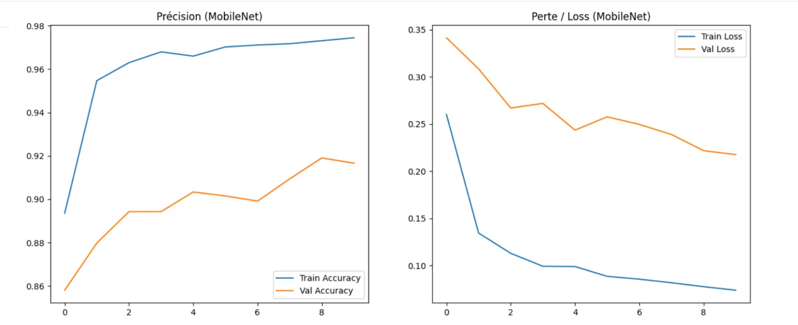
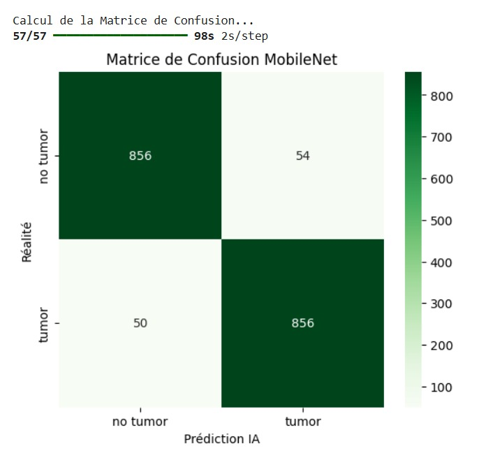

# 🧠 Brain Tumor Detection — MobileNetV2 (Transfer Learning)

> **Mini-Projet Deep Learning** — ENSA d'Oujda | Filière GSEIR-4 | 2025/2026  
> Classification binaire d'images IRM cérébrales par Transfer Learning avec MobileNetV2

## 👩‍💻 Réalisé par 

- **El Azimani Chaimae**
- **Bouras Jihane**

## 📌 Problématique

Le CNN Standard présente des oscillations sur la validation et un risque d'overfitting,
ce projet propose une solution améliorée basée sur le **Transfer Learning avec MobileNetV2**.  
C' est un modèle capable de classifier automatiquement une image IRM en :
- ✅ **No Tumor** — Cerveau sain
- ⚠️ **Tumor** — Tumeur détectée

avec de **meilleures performances** et des **résultats plus stables**.

## 🎯 Objectifs

- Appliquer le **Transfer Learning** avec MobileNetV2 pré-entraîné sur ImageNet
- Comparer les résultats avec le CNN standard
- Obtenir une meilleure généralisation avec **moins d'epochs**
- Évaluer les performances via courbes, matrice de confusion et rapport de classification

## 📊 Dataset

| Split | Nombre d'images |
|---|---|
| **Entraînement (80%)** | 6 622 images |
| **Validation (20%)** | 1 655 images |
| **Test** | 1 816 images |
| **Classes** | `no_tumor` (0) / `tumor` (1) |

### Exemples d'images IRM (avec Data Augmentation)

<p align="center">
  
</p>

## 🛠️ Partie Matérielle — Paramètres du Modèle

| Paramètre | Valeur |
|---|---|
| **Taille des images** | 224 × 224 pixels |
| **Batch size** | 32 |
| **Epochs** | 10 |
| **Optimizer** | Adam |
| **Loss function** | Binary Crossentropy |
| **Métrique** | Accuracy |
| **Base model** | MobileNetV2 (pré-entraîné ImageNet) |

## 💻 Partie Logicielle (Software)

### 🧾 Technologies utilisées

| Technologie | Rôle |
|---|---|
| **Python 3** | Langage principal |
| **TensorFlow / Keras** | Framework Deep Learning |
| **MobileNetV2** | Modèle pré-entraîné sur ImageNet (Transfer Learning) |
| **ImageDataGenerator** | Data Augmentation (rotation, flip, zoom, shear...) |
| **GlobalAveragePooling2D** | Remplacement moderne du Flatten |
| **Matplotlib / Seaborn** | Visualisation des courbes et matrices |
| **Scikit-learn** | Matrice de confusion + rapport de classification |

## ⚙️ Architecture MobileNetV2 — Transfer Learning

<p align="center">
  
</p>

```python
# A. Charger MobileNetV2 pré-entraîné (sans la tête de classification)
base_model = MobileNetV2(input_shape=(224, 224, 3),
                         include_top=False,
                         weights='imagenet')
# B. Geler les couches (Freezing)
base_model.trainable = False

# C. Ajouter notre tête de classification personnalisée
x = base_model.output
x = GlobalAveragePooling2D()(x)
x = Dropout(0.2)(x)
predictions = Dense(1, activation='sigmoid')(x)

model = Model(inputs=base_model.input, outputs=predictions)
model.compile(optimizer='adam', loss='binary_crossentropy', metrics=['accuracy'])
```

## ⚙️ Logique — Data Augmentation

Pour éviter l'overfitting et enrichir le dataset artificiellement :

```python
ImageDataGenerator(
    rescale            = 1./255,   # Normalisation [0-1]
    rotation_range     = 20,       # Rotation aléatoire
    width_shift_range  = 0.1,      # Décalage horizontal
    height_shift_range = 0.1,      # Décalage vertical
    shear_range        = 0.1,      # Cisaillement
    zoom_range         = 0.1,      # Zoom
    horizontal_flip    = True,     # Miroir horizontal
    validation_split   = 0.2       # 20% pour validation
)
```

## 🔨 Entraînement

### Logs d'entraînement (10 epochs)

<p align="center">
  
</p>

## 📊 Résultats

### Courbes Accuracy & Loss

<p align="center">
  
</p>

> 📌 Les courbes MobileNet sont **beaucoup plus stables** que le CNN standard.  
> Pas d'oscillations importantes — signe d'une excellente généralisation.

### 🎯 Évaluation Finale sur données de Test

| Métrique | CNN | MobileNet |
|---|---|---|
| **Accuracy** | 95.04% | **~97.45%** |
| **Stabilité courbes** | Oscillations 🔴 | Stable |
| **Epochs nécessaires** | 15 | **10** |

### Matrice de Confusion

<p align="center">
  
</p>

| | Prédit : No Tumor | Prédit : Tumor |
|---|---|---|
| **Réel : No Tumor** | 856 ✅ | 54 ❌ |
| **Réel : Tumor** | 50 ❌ | 856 ✅ |

### Rapport de Classification

| Classe | Precision | Recall | F1-Score | Support |
|---|---|---|---|---|
| **No Tumor** | ~0.94 | ~0.94 | ~0.94 | 910 |
| **Tumor** | ~0.94 | ~0.94 | ~0.94 | 906 |
| **Global** | **~0.94** | **~0.94** | **~0.94** | 1816 |

## 🔑 Concepts Clés Appliqués

| Concept | Description |
|---|---|
| **Transfer Learning** | Réutilisation des poids pré-entraînés sur ImageNet |
| **MobileNetV2** | Architecture légère à base de Depthwise Separable Convolutions |
| **Freezing** | Geler les couches de base — on réentraîne uniquement la tête |
| **GlobalAveragePooling2D** | Alternative moderne au Flatten, réduit l'overfitting |
| **Dropout(0.2)** | Régularisation pour éviter le surapprentissage |
| **Sigmoid** | Activation finale → probabilité [0,1] |
| **Confusion Matrix** | Évaluation détaillée des prédictions |
